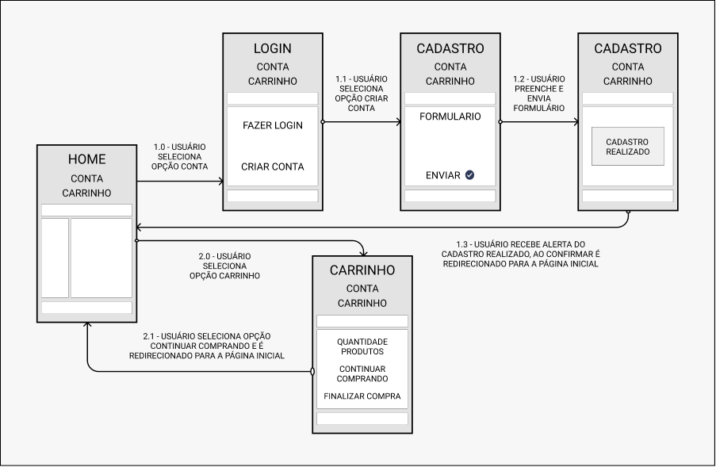
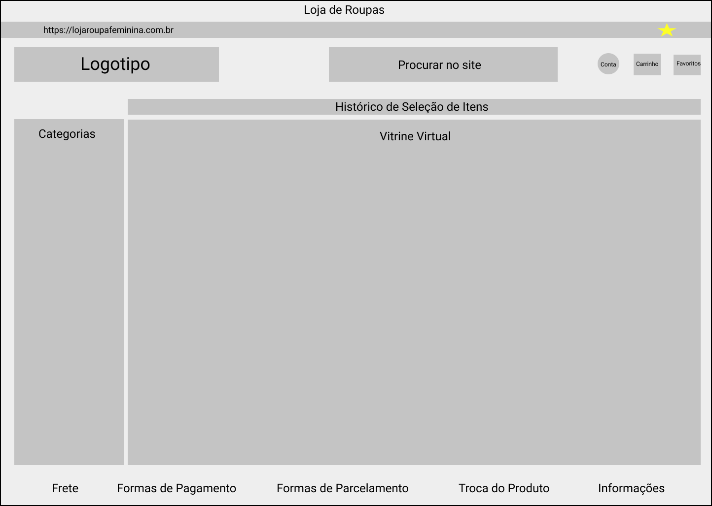
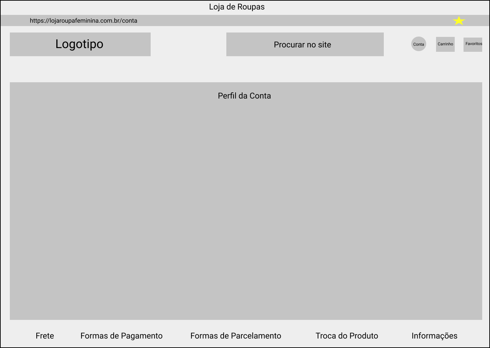
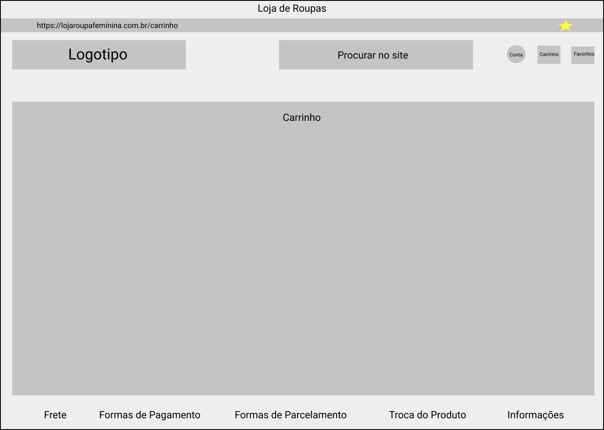

# Projeto de Interface

Visão geral da interação do usuário pelas telas do sistema (User Flow) e protótipos interativos das telas com as funcionalidades que fazem parte do sistema (Wireframes).

## User Flow

Fluxo de Usuário (User Flow) das telas página inicial, conta e carrinho do site. Demonstração dos caminhos que o usuário pode seguir entre as telas do site e possíveis ações nas respectivas telas.

[Protótipo interativo](https://www.figma.com/proto/PWUs4185xGykDG6wF7dE0f/Loja-de-Roupas-User-Flow?node-id=107%3A167&scaling=contain&page-id=107%3A4) do fluxo de usuário na tela de um smartphone Android (360x640 px).

[Fluxo de usuário](https://www.figma.com/file/PWUs4185xGykDG6wF7dE0f/Loja-de-Roupas-User-Flow?node-id=107%3A4) desenvolvido pela equipe na plataforma Figma.

## Wireframes

Wireframes das principais interfaces da plataforma com descrições dos requisitos funcionais e requisitos não funcionais que atendem as histórias de usuários descritas nas [Especificações do Projeto](https://github.com/ICEI-PUC-Minas-PMV-SI/pmv-si-2021-1-e1-proj-web-t3-loja-de-roupas/blob/main/docs/2-Especifica%C3%A7%C3%A3o%20do%20Projeto.md).

[Wireframes](https://www.figma.com/file/F2UUXfbeisdWmCwgaTm7hV/Loja-de-Roupas-Wireframes?node-id=11%3A74) desenvolvidos pela equipe na plataforma Figma.

### Wireframe da página inicial

> - "Logotipo" redireciona o usuário para a página inicial do site.
> - "Procurar no site" permite que o usuário pesquise um produto desejado digitando seu nome.
> - "Categorias" permite que o usuário selecione o produto desejado através de diversas categorias como: tipo de roupa, cor, estilo e preço.
> - "Histórico de Seleção de Itens" permite que o usuário visualize a combinação de categorias escolhidas do produto, tanto pela funcionalidade "Procurar no site" quanto em "Categorias".
> - "Vitrine Virtual" permite que o usuário visualize a imagem do produto pesquisado e uma breve descrição dele. O usuário pode clicar no produto e ser redirecionado para a página do produto onde pode adicioná-lo ao "Carrinho" ou aos "Favoritos".
> - "Conta" redireciona o usuário para a página onde ele pode criar uma conta ou acessar a conta no site.
> - "Carrinho" redireciona o usuário para a página onde ele pode visualizar os produtos adicionados ao carrinho.
> - "Favoritos" redireciona o usuário para a página onde ele pode visualizar os produtos adicionados a uma lista de pré-compra.
> - "Frete" permite que o usuário clique e visualize quais são as regras de frete.
> - "Formas de Pagamento" permite que o usuário clique e visualize quais são as formas de pagamento.
> - "Formas de Parcelamento" permite que o usuário clique e visualize quais são as formas para realizar pagamento parcelado.
> - "Troca do Produto" permite que o usuário clique e visualize quais são as formas de realizar a troca do produto.
> - "Informações" permite que o usuário visualize as informações da Loja de Roupas.

### Wireframe da página de conta do usuário

> - "Logotipo" redireciona o usuário para a página inicial do site.
> - "Procurar no site" permite que o usuário pesquise um produto desejado digitando seu nome. Ao digitar o nome do produto e finalizar a busca, o usuário é redirecionado para a página inicial.
> - "Perfil da Conta" permite que o usuário cadastre seus dados pessoais para realizar abertura de conta no site. Caso o usuário tenha conta no site, existe um botão <Log In> para acessar sua conta no site.
> - "Conta" redireciona o usuário para a página onde ele pode criar uma conta ou acessar a conta no site.
> - "Carrinho" redireciona o usuário para a página onde ele pode visualizar os produtos adicionados ao carrinho.
> - "Favoritos" redireciona o usuário para a página onde ele pode visualizar os produtos adicionados a uma lista de pré-compra.
> - "Frete" permite que o usuário clique e visualize quais são as regras de frete.
> - "Formas de Pagamento" permite que o usuário clique e visualize quais são as formas de pagamento.
> - "Formas de Parcelamento" permite que o usuário clique e visualize quais são as formas para realizar pagamento parcelado.
> - "Troca do Produto" permite que o usuário clique e visualize quais são as formas de realizar a troca do produto.
> - "Informações" permite que o usuário visualize as informações da Loja de Roupas.

### Wireframe da página carrinho de compras

> - "Logotipo" redireciona o usuário para a página inicial do site.
> - "Procurar no site" permite que o usuário pesquise um produto desejado digitando seu nome. Ao digitar o nome do produto e finalizar a busca, o usuário é redirecionado para a página inicial.
> - "Carrinho" permite que o usuário visualize os produtos selecionados na "Vitrine Virtual" ou na página do produto após ter clicado no botão <Comprar>. Essa funcionalidade tem interação direta com "Favoritos", onde o usuário pode adicionar produtos interessantes e posteriormente adicioná-los ao "Carrinho" para finalizar a compra.
> - "Conta" redireciona o usuário para a página onde ele pode criar uma conta ou acessar a conta no site.
> - "Carrinho" redireciona o usuário para a página onde ele pode visualizar os produtos adicionados ao carrinho.
> - "Favoritos" redireciona o usuário para a página onde ele pode visualizar os produtos adicionados a uma lista de pré-compra.
> - "Frete" permite que o usuário clique e visualize quais são as regras de frete.
> - "Formas de Pagamento" permite que o usuário clique e visualize quais são as formas de pagamento.
> - "Formas de Parcelamento" permite que o usuário clique e visualize quais são as formas para realizar pagamento parcelado.
> - "Troca do Produto" permite que o usuário clique e visualize quais são as formas de realizar a troca do produto.
> - "Informações" permite que o usuário visualize as informações da Loja de Roupas.

