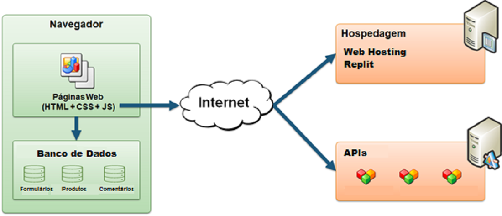
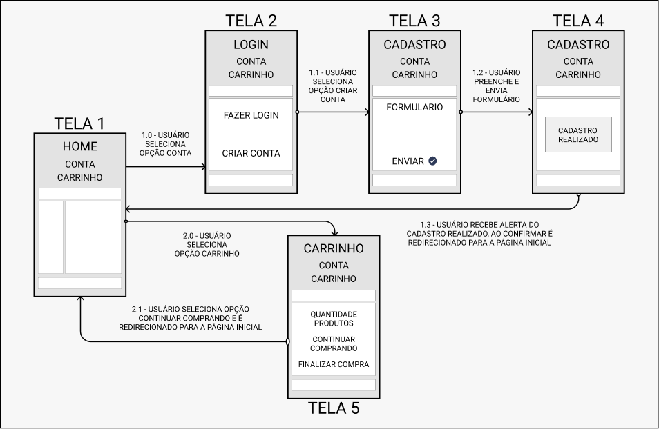
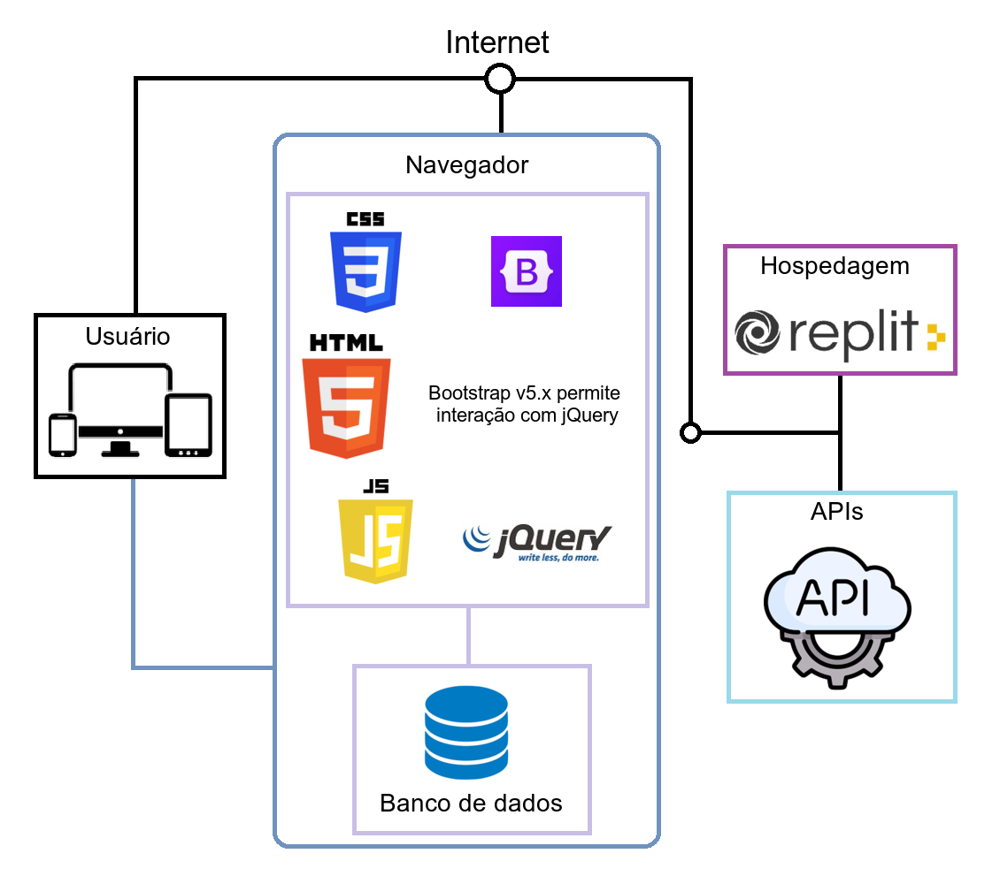

# Arquitetura da Solução

Definição de como o software é estruturado em termos dos componentes que fazem parte da solução e do ambiente de hospedagem da aplicação.

## Diagrama de componentes

Diagrama que permite a modelagem física do sistema, através da visão dos seus componentes e relacionamentos entre os mesmos.

Os componentes que fazem parte da solução são apresentados na figura abaixo:

Figura 01 - Arquitetura da Solução

A solução implementada conta com os seguintes módulos:

- **Navegador** - Interface básica do sistema  
  - **Páginas Web** - Conjunto de arquivos HTML, CSS, JavaScript e imagens que implementam as funcionalidades do sistema.
   - **Banco de Dados - Local Storage** - armazenamento persistente mantido no Navegador, onde são implementados bancos de dados baseados em JSON. Armazenamento destinado ao usuário sem cadastro no site. Os bancos de dados são: 
     - **Formulários** - formulário de cadastro de usuário, formulário de pagamento
     - **Produtos** - interação do usuário com informações dos produtos da loja
     - **Comentários** - feedback do produto feito pelo usuário
   - **Banco de Dados - Session Storage** - armazenamento não persistente mantido no Navegador, onde são implementados bancos de dados baseados em JSON. Armazenamento destinado ao usuário com cadastro no site. Os bancos de dados são: 
     - **Formulários** - formulário de alteração e exclusão de dados do cadastro de usuário, formulário de pagamento
     - **Produtos** - interação do usuário com informações dos produtos da loja
     - **Comentários** - feedback do produto feito pelo usuário
- **APIs** - plataforma que permite o acesso às funcionalidades exibidas no site.
- **Hospedagem** - local na Internet onde as páginas são mantidas e acessadas pelo navegador (Web Hosting Replit).

Foi feito um fluxo de usuário com duas opções de escolha. Assim que o usuário entra na plataforma, ele é apresentado à tela inicial (Tela 1) onde ele é confrontado com as opções de "CONTA" e "CARRINHO".

Caso ele opte por seguir pelo primeiro caminho "CONTA", ele é redirecionado para a tela LOGIN (Tela 2), onde pode "FAZER LOGIN" ou "CRIAR CONTA". Ao selecionar a opção criar conta ele é redirecionado para a tela CADASTRO (Tela 3), onde ele pode preencher um formulário com seus dados pessoais e enviá-lo clicando no botão enviar para que seja feito o processamento. Assim que o processo termina um pop-up exibe uma mensagem para o usuário dizendo que o cadastro foi realizado (Tela 4), ao fechar o pop-up o usuário é redirecionado para a Tela 1.

O segundo caminho que usuário pode seguir é escolher a opção "CARRINHO", ele é redirecionado para a tela CARRINHO (Tela 5), onde pode ver a "QUANTIDADE DE PRODUTOS" escolhidos na Tela 1, "CONTINUAR COMPRANDO" e/ou "FINALIZAR COMPRA". Ao selecionar a opção continuar comprando o usuário é redirecionado para Tela 1. Vale ressaltar que se o usuário não tenha adicionado produtos ao carrinho, ele não verá nenhum produto e consequentemente a opção finalizar compra não estará disponível e só lhe restará a opção continuar comprando.

A imagem a seguir ilustra o fluxo do usuário em nossa solução.

Figura 02 - Fluxo do Usuário

## Tecnologias Utilizadas

As linguagens utilizadas no desenvolvimento da aplicação web são HTML, CSS e JavaScript. As IDE's escolhidas para a edição do código foram o VS Code e Replit. A primeira pelo fato de ter extensões úteis para o desenvolvimento do software. A segunda por ser uma IDE gratuita online que aceita as linguagens utilizadas, permite integração com o repositório do GitHub e que será utilizada para hospedagem do site. A biblioteca [jQuery](https://jquery.com/) será utilizada para manipular funcionalidades como cliques em botões, textos e imagens. Para que o layout do site seja responsivo, será utilizado o framework web [Bootstrap](https://getbootstrap.com/).

A imagem abaixo mostra a relação entre as tecnologias que serão utilizadas no desenvolvimento do site.

Figura 03 - Tecnologias Utilizadas

## Hospedagem

A hospedagem do site será feita na plataforma [Replit](https://replit.com/). A plataforma fornece IDE para a edição do código, integração com o repositório do projeto no GitHub como também a visualização e edição do mesmo código ([Replit Multiplayer](https://blog.replit.com/multi)), o que permite a colaboração da equipe de forma online.
