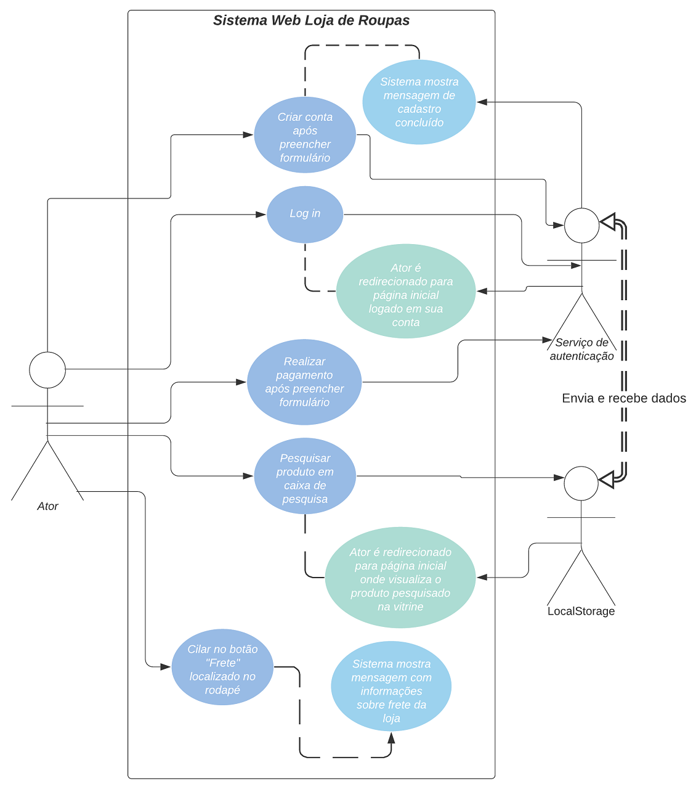

# Plano de Testes de Software

Este plano de testes tem como objetivo listar os testes que serão executados com os requisitos selecionados do Sistema Web para a Loja de Roupas Bruthelu. Após a execução dos casos de teste, será feito a descrição das estratégias a serem empregadas, a identificação dos recursos necessários e disponibilização de uma estimativa dos esforços de teste.

## Diagrama de Caso de Uso - UML

O cenário escolhido para representar o plano de testes do software em desenvolvimento está descrito na imagem abaixo.

Figura 01 - Diagrama de caso de uso

## Tabelas dos Requisitos Selecionados

**Caso de Teste** | **CT01 - Criar conta após preencher formulário**
 :--------------: | ------------
**Pré-Condição**  | Acessar a tela cadastro.
**Procedimento**  | 1) O ator preenche os campos solicitados do formulário e clica no botão "Enviar". 2) O serviço de autenticação verifica se os dados inseridos são válidos, caso não sejam, o ator deve preencher novamente os campos inválidos e enviar o formulário. 3) O serviço de autenticação interage com o LocalStorage com o objetivo de armazenar os dados ator. 4) O sistema mostra mensagem para o ator que o cadastro foi concluído. 5) O ator é redirecionado para a página inicial.
**Resultado esperado** | Conseguir criar conta no site.
**Dados de entrada** | Inserção de dados válidos no formulário de cadastro.
**Prioridade**    | Alta.
**Ambiente**      | Microsoft Windows 10 Pro 21H1 19043.1081, Google Chrome Versão 91.0.4472.114 (Versão oficial) 64 bits.
**Técnica**       | Manual.
**Iteração**      | 1a Iteração.

**Caso de Teste** | **CT02 - Fazer Log In em conta criada**
 :--------------: | ------------
**Pré-Condição**  | Acessar a tela conta.
**Procedimento**  | 1) O ator preenche os campos solicitados do formulário e clica no botão "Entrar". 2) O serviço de autenticação verifica se os dados inseridos são válidos, caso não sejam, o ator deve preencher novamente os campos inválidos e enviar o formulário. 3) O ator pode selecionar a caixa checkbox "Lembre de mim", que tem a função de manter o ator logado em sua conta, mesmo após fechar o navegador. 4) O serviço de autenticação interage com o LocalStorage com o objetivo de verificar os dados ator. 5) O ator é redirecionado para a página inicial logado em sua conta.
**Resultado esperado** | Fazer log in em conta no site.
**Dados de entrada** | Inserção de dados válidos nos campos de log in.
**Prioridade**    | Alta.
**Ambiente**      | Microsoft Windows 10 Pro 21H1 19043.1081, Google Chrome Versão 91.0.4472.114 (Versão oficial) 64 bits.
**Técnica**       | Manual.
**Iteração**      | 1a Iteração.
 
**Caso de Teste** | **CT03 - Procurar produto em caixa de pesquisa**
 :--------------: | ------------
**Pré-Condição**  | Acessar tela do sistema com barra de navegação.
**Procedimento**  | 1) O ator digita na caixa de pesquisa, localizada na barra de navegação, o nome do produto. 2) O ator deve clicar no botão de lupa para efetuar a pesquisa. 3) O LocalStorage vai verificar se o produto pesquisado existe no banco de dados. 4) O ator é redirecionado para a página inicial. 5) O sistema exibe o produto na vitrine virtual.
**Resultado esperado** | Visualizar o produto pesquisado na vitrine virtual
**Dados de entrada** | Inserção de nome de produto na caixa de pesquisa
**Prioridade**    | Média.
**Ambiente**      | Microsoft Windows 10 Pro 21H1 19043.1081, Google Chrome Versão 91.0.4472.114 (Versão oficial) 64 bits.
**Técnica**       | Manual.
**Iteração**      | 1a Iteração.
 
**Caso de Teste** | **CT04 - Realizar pagamento**
 :--------------: | ------------
**Pré-Condição**  | Acessar a tela carrinho.
**Procedimento**  | 1) O ator preenche os campos solicitados no formulário referente ao "Endereço de Entrega". 2) O ator pode selecionar a caixa checkbox "O endereço de entrega é o mesmo do cadastro", que tem a função de preencher o campo de endereço automaticamente, utilizando os dados cadastrados, caso o ator esteja logado em sua conta. 3) O ator pode selecionar a caixa checkbox "Guarde essa informação para a próxima vez", que tem a função de preencher automaticamente os campos de endereço na próxima vez que o ator preencher o formulário, caso o ator esteja logado em sua conta. 4) O ator preenche os campos solicitados no formulário "Pagamento", no qual pode escolher entre três formas de pagamento. 5) O ator deve clicar no botão "Finalizar Compra" para finalizar o pedido e enviar os formulários. 6) O serviço de autenticação verifica se os dados inseridos são válidos, caso não sejam, o ator deve preencher novamente os campos inválidos e enviar o formulário. 7) O sistema mostra mensagem para o ator com informação do produto adquirido e data prevista de entrega.
**Resultado esperado** | Finalizar a compra de um produto
**Dados de entrada** | Dados válidos em formulários de cadastro e de pagamento
**Prioridade**    | Média.
**Ambiente**      | Microsoft Windows 10 Pro 21H1 19043.1081, Google Chrome Versão 91.0.4472.114 (Versão oficial) 64 bits.
**Técnica**       | Manual.
**Iteração**      | 1a Iteração.

**Caso de Teste** | **CT05 - Visualizar Informações de Frete**
 :--------------: | ------------
**Pré-Condição**  | Acessar tela do sistema com rodapé.
**Procedimento**  | 1) O ator clica no botão "Frete" localizado no rodapé. 2) O sistema mostra mensagem para o ator com informações   sobre o frete da loja.
**Resultado esperado** | Visualizar mensagem sobre frete da loja
**Dados de entrada** | Nenhum
**Prioridade**    | Baixa.
**Ambiente**      | Microsoft Windows 10 Pro 21H1 19043.1081, Google Chrome Versão 91.0.4472.114 (Versão oficial) 64 bits.
**Técnica**       | Manual.
**Iteração**      | 1a Iteração.

## Categoria dos Testes

A categoria Teste de Funcionalidade será a técnica utilizada nos testes de software do sistema em desenvolvimento. Esta categoria tem como objetivo simular cenários de negócio - neste caso, o cenário do Sistema Web para a Loja de Roupas Bruthelu - e garantir que todos os requisitos funcionais foram implementados.
