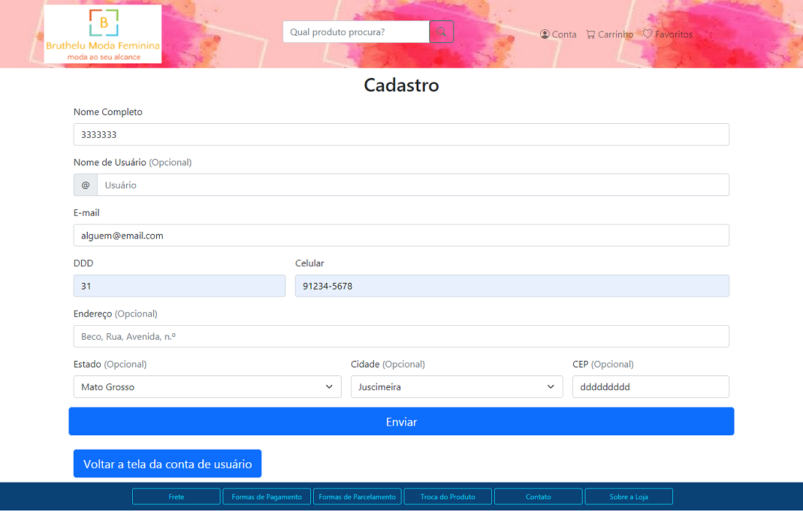
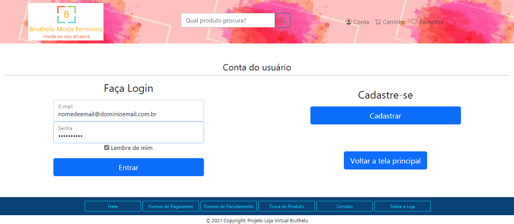
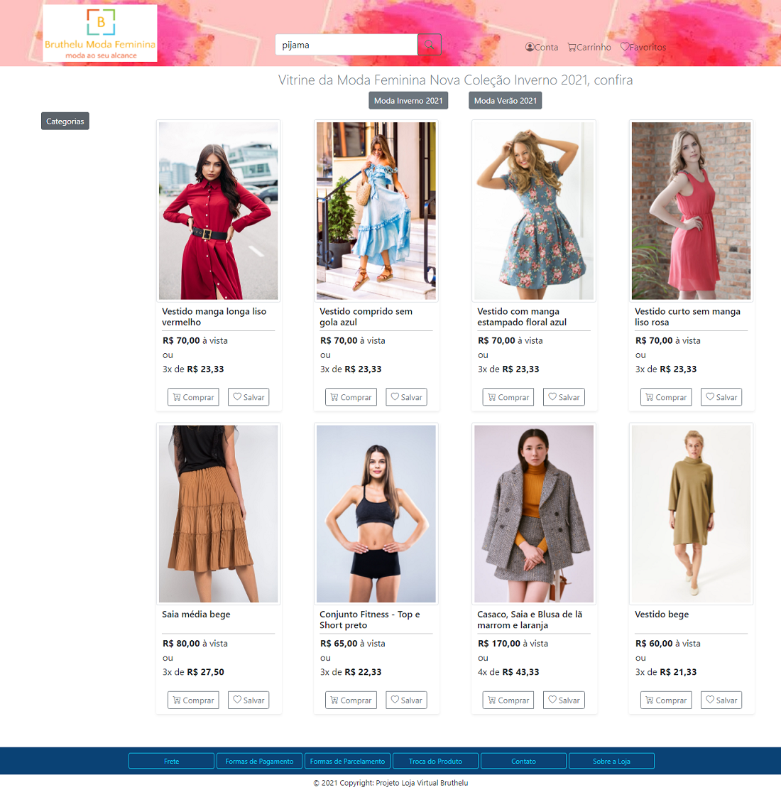
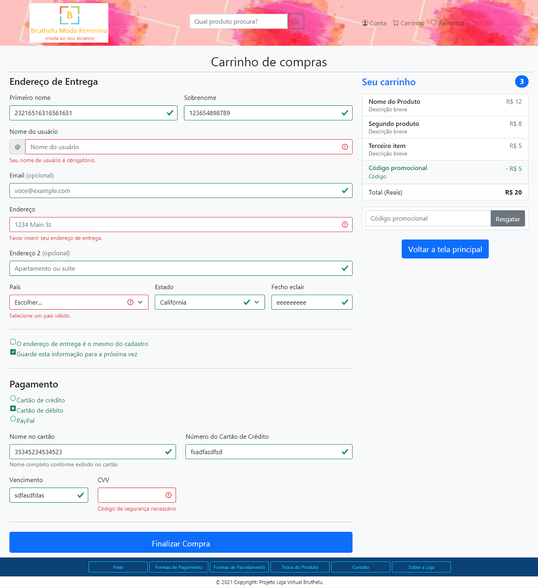

# Registro de Testes de Software

Na execução dos testes de software, foi possível notar as seguintes evidências:

1. *CT01 - Criar conta após preencher formulário* - Os procedimentos foram executados conforme o planejado e o resultado obtido foi parcialmente como o esperado.
2. *CT02 - Fazer Log In em conta criada* - Os procedimentos foram executados parcialmente conforme o planejado e o resultado obtido não foi como o esperado.
3. *CT03 - Procurar produto em caixa de pesquisa* - Os procedimentos foram executados parcialmente conforme o planejado e o resultado obtido não foi como o esperado.
4. *CT04 - Realizar pagamento* - Os procedimentos foram executados parcialmente conforme o planejado e o resultado obtido não foi como o esperado.
5. *CT05 - Visualizar Informações de Frete* - Os procedimentos foram executados conforme o planejado e o resultado obtido foi parcialmente como o esperado.

## Avaliação

Os resultados dos testes podem ser considerados satisfatórios, levando em conta que a parte funcional básica do sistema foi executada. Por exemplo, elementos interativos como botões, campos de preenchimento em formulários e caixas checkbox.

Nos cinco casos de teste, foi observado que as implementações efetuadas no sistema tiveram destaque, especialmente a adição de funções que permitem o sistema ficar mais interativo. Não menos importante, vale ressaltar a parte visual do sistema, que também está bem avançada, mas não se encaixa nessa categoria de teste.

As implementações acrescentadas foram positivas, porém os testes também apresentaram falhas. Duas funcionalidades testadas, *CT01* e *CT02*, nas quais se relacionam e necessitam enviar e receber dados do LocalStorage, ainda não realizam essa interação. Somente uma delas (CT01) envia e recebe dados do LocalStorage, o que compromete a interação do ator com o sistema. Outra funcionalidade, *CT03*, apresenta uma falha que envolve o LocalStorage, sendo que só é possível preencher o campo para pesquisar o produto e fazer o pedido de busca, mas não existe nenhum produto cadastrado, o que não retorna o resultado esperado. No *CT04*, os pontos positivos foram destaque, mas como se trata de validação de dados financeiros em um sistema web de um projeto acadêmico, o resultado não pôde ser como o esperado. A funcionalidade *Visualizar Informações de Frete*, pode ser considerada a mais satisfatória, apesar do resultado, devido a mensagem exibida ser apenas "frete".

Abaixo está disposto cada caso de teste efetuado, com a descrição do que foi encontrado e o print da tela no momento do teste.

> CT01 - Criar conta após preencher formulário

Como dito, os botões e campos de preenchimento estão funcionando e interagem com o serviço de validação, porém o campo nome aceita números e o campo CEP aceita letras. Para alterar isso, será preciso adicionar uma função que restringe a inserção de determinados dados. Além disso, os dados inseridos são enviados para o LocalStorage do navegador ao enviar o formulário, nos quais podem ser usados para realizar log in em cadastro criado no sistema (essa funcionalidade ainda não foi implementada). Portanto, o resultado obtido teve um impacto alto no sistema. 

Abaixo a representação da tela no momento do teste:

Figura 01 - Tela Cadastro com campos nome e CEP com dados fora do padrão

Figura 02 - Tela Cadastro e LocalStorage com os dados armazenados

> CT02 - Fazer Log In em conta criada

Esta funcionalidade está diretamente ligada ao cadastro de usuários no sistema e como dito, ela ainda não está recebendo os dados do LocalStorage, especificamente "email" e "senha". Inclusive este último elemento deve ser implementado no formulário de cadastro. Apesar disso, os botões, campos de preenchimento e caixa checkbox funcionaram, mas o resultado não foi como esperado, gerando um impacto alto no sistema.

Abaixo a representação da tela no momento do teste:

Figura 03 - Tela Conta opção de fazer log in

> CT03 - Procurar produto em caixa de pesquisa

A funcionalidade pesquisar produto é outra que está pendente de cadastro de dados no LocalStorage. Igualmente as outras funcionalidades, o botão para efetuar a pesquisa funcionou, porém o produto pesquisado não foi exibido na vitrine. Neste caso, o botão está programado para redirecionar o usuário para a tela de pagamento. Desse modo, o resultado obtido não foi como esperado, gerando um impacto médio no sistema.

Abaixo a representação da tela no momento do teste:

Figura 04 - Tela Inicial opção de pesquisar produto

> CT04 - Realizar pagamento

Nesta funcionalidade, as implementações visuais realizadas quanto aos campos obrigatórios foram relevantes, inclusive serão utilizadas em outros formulários. Porém, apresenta a mesma falha do formulário de cadastro, na qual os campos que deveriam aceitar apenas letras, aceitam números e campos que deveriam aceitar apenas números, aceitam letras. Foi explicado que essa funcionalidade é apenas uma simulação da venda de um produto, portanto não implica em uma venda real. Assim, no formulário "Pagamento", os dados não devem ser comparados com a realidade. Além disso, ainda não existe produto armazenado no LocalStorage, o que impossibilita a venda simulada. Portanto, o resultado obtido não foi como esperado, tendo um impacto médio no sistema.

Abaixo a representação da tela no momento do teste:

Figura 05 - Tela Carrinho com campos fora do padrão

> CT05 - Visualizar Informações de Frete

O botão interativo das informações de frete da loja está funcionado corretamente, porém a mensagem exibida precisa ser reformulada. Para resolver isso basta alterar a mensagem. Assim, o resultado pode ser considerado como o esperado, gerando um impacto baixo no sistema.

Abaixo a representação da tela no momento do teste:

Figura 06 - Tela Inicial com mensagem "frete" exibida pelo sistema
